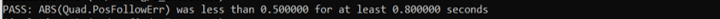
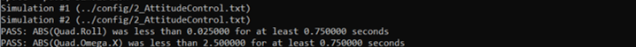
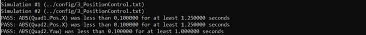
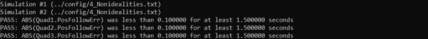
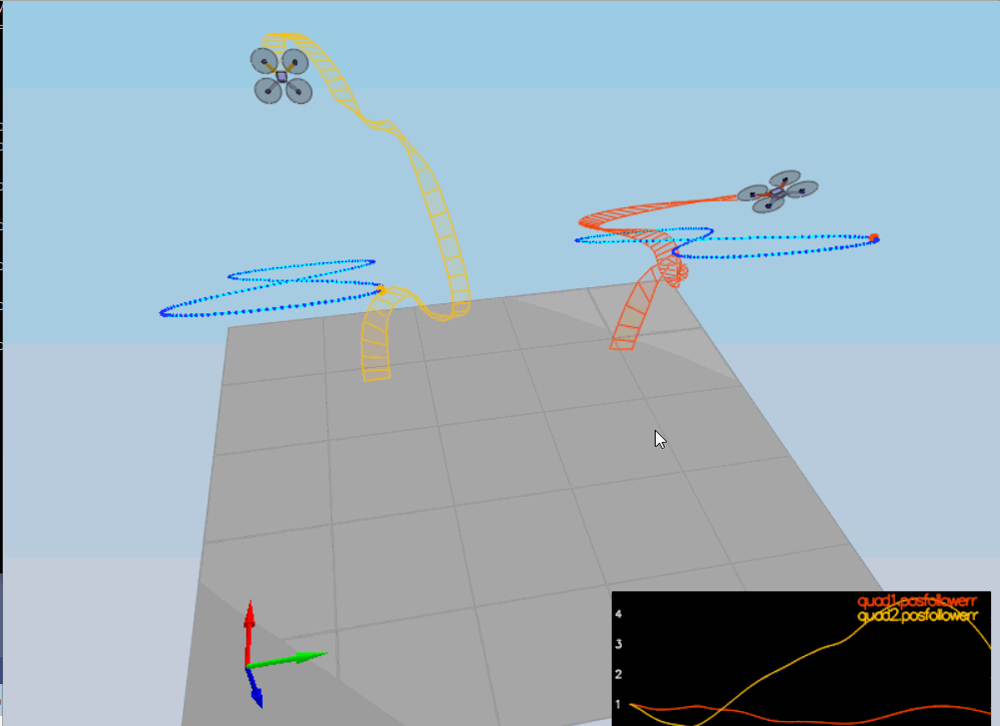

This WRITEUP aims to explain the different steps done to build the quadrotor controller following the given tasks on README file.
For every task, there will be the modifications and test results.

## The tasks ##

### Tuning mass parameter (scenario 1) ###
Changing the value of the mass from 0.5 to 0.5 permit to obtain the expected result.

### Body rate and roll/pitch control (scenario 2) ###
#### Implementing Body rate control ####
After implementing the functions GenerateMotorCommands() and BodyRateControl(), the tuned KpPQR value is:
#kpPQR = 90, 90, 5
This shows a PASS result as shown in figure below.
#### Implement roll / pitch control ####
After implementing the functon RollPitchControl(), the tuned KpBank value is:
#kpBank = 10
This shows a PASS result as shown in figure below.

### Position/velocity and yaw angle control (scenario 3) ###
After implementing the functions LateralPositionControl(), AltitudeControl() and YawControl(), the tuned parametrs value are:
#kpPQR = 90, 90, 10
#kpPosXY = 20
#kpPosZ = 40
#kpVelXY = 8
#kpVelZ = 9
#kpYaw = 6
This shows a PASS result as shown in figure below.

### Non-idealities and robustness (scenario 4) ###
To get the three quadrotors following their paths, the parameter KpPosXY was been tuned again.
This shows a PASS result as shown in figure below.

### Tracking trajectories (scenario 5) ###
In the beginning of flight, the two quadrotors does not follow their paths. But after, they could do it.
The console shows a FAIL message.
There is a need to retune parameters (to be done when time allows).

